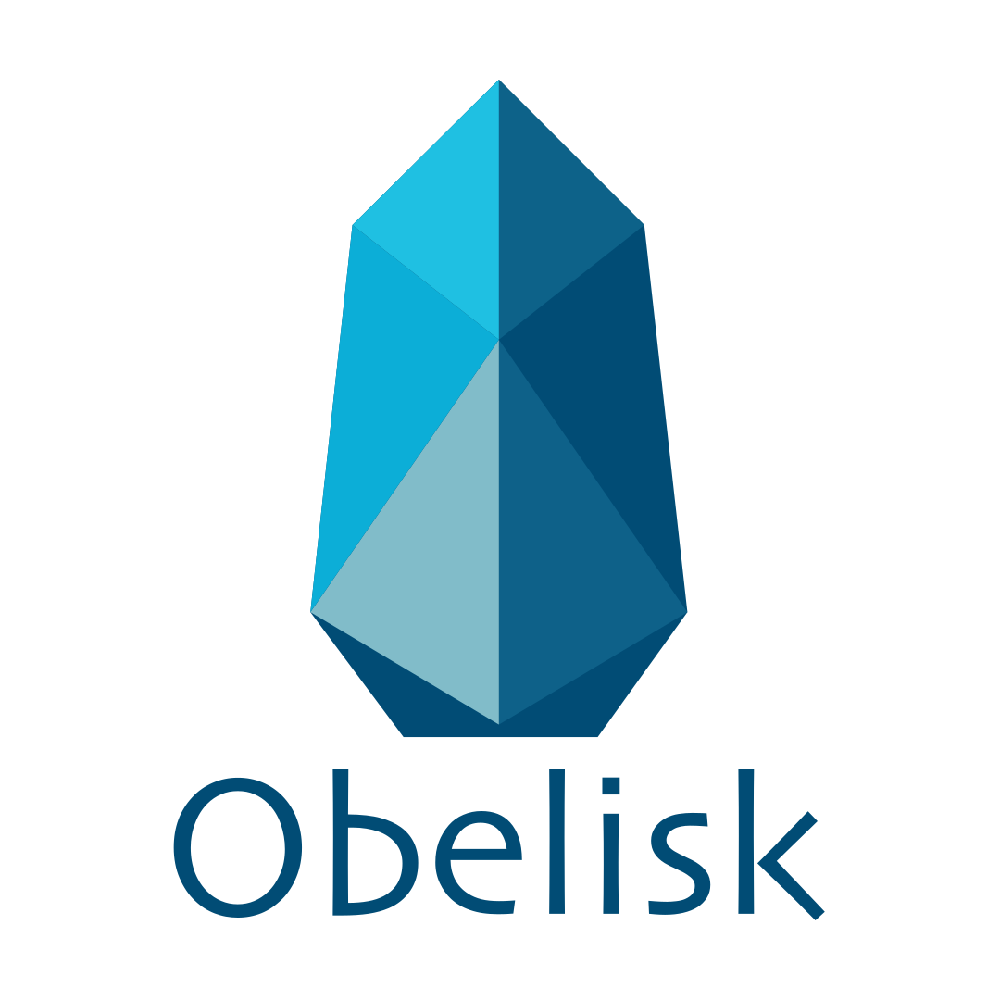

<p align="center">
  
</p>

Obelisk is a Crystal syntax highlighting library inspired by [Chroma](https://github.com/alecthomas/chroma). Obelisk provides fast, extensible syntax highlighting for Crystal code and other languages.

## Features

- **Multi-language support**: Built-in lexers for Crystal, JSON, and YAML
- **Multiple output formats**: HTML, ANSI terminal colors, plain text, and JSON
- **Customizable themes**: GitHub, Monokai, and Black & White themes included
- **Theme serialization**: Load and export themes in JSON, TextMate (.tmTheme), and Chroma XML formats
- **Cross-platform themes**: Use themes from VS Code, Sublime Text, and Go's Chroma highlighter
- **Extensible architecture**: Easy to add new languages and formatters
- **Type-safe design**: Leverages Crystal's type system for reliability
- **Fast performance**: Efficient regex-based lexing

## Installation

Add this to your application's `shard.yml`:

```yaml
dependencies:
  obelisk:
    github: watzon/obelisk
```

Then run:

```bash
shards install
```

## Quick Start

```crystal
require "obelisk"

# Simple syntax highlighting
code = %q(
  def hello(name : String) : String
    "Hello, #{name}!"
  end
)

# Highlight Crystal code as HTML
html = Obelisk.highlight(code, "crystal", "html", "github")
puts html

# Highlight with ANSI colors for terminal
ansi = Obelisk.highlight(code, "crystal", "terminal", "monokai")
puts ansi
```

## Usage

### Basic Highlighting

```crystal
# Quick highlighting
result = Obelisk.highlight(source_code, language, formatter, style)

# Available options
languages = Obelisk.lexer_names      # ["crystal", "json", "yaml", "text"]
formatters = Obelisk.formatter_names # ["html", "html-classes", "terminal", "text", "json"]
styles = Obelisk.style_names         # ["github", "monokai", "bw"]
```

### Manual Tokenization

```crystal
# Get a lexer and tokenize manually
lexer = Obelisk.lexer("crystal")
tokens = lexer.tokenize(source_code) if lexer

# Process tokens
tokens.each do |token|
  puts "#{token.type}: #{token.value.inspect}"
end
```

### Custom Formatting

```crystal
# Create formatters with options
html_formatter = Obelisk::HTMLFormatter.new(
  with_classes: true,
  class_prefix: "syntax-",
  with_line_numbers: true
)

# Get a style
style = Obelisk::Styles.github

# Format manually
output = html_formatter.format(tokens, style)
```

### CSS Generation

```crystal
# Generate CSS for HTML with classes
formatter = Obelisk::HTMLFormatter.new(with_classes: true)
css = formatter.css(Obelisk::Styles.github)
puts css
```

### Theme Import/Export

```crystal
# Load themes from different formats
tmtheme_style = Obelisk.load_theme("path/to/theme.tmTheme")     # TextMate theme
chroma_style = Obelisk.load_theme("path/to/theme.xml")          # Chroma XML theme
json_style = Obelisk.load_theme("path/to/theme.json")           # Obelisk JSON theme

# Export themes to different formats
json_output = Obelisk.export_theme_json(style, pretty: true)
tmtheme_output = Obelisk.export_theme_tmtheme(style)
chroma_output = Obelisk.export_theme_chroma(style)

# Save themes to files (format auto-detected from extension)
Obelisk.save_theme(style, "exported.json")      # JSON format
Obelisk.save_theme(style, "exported.tmtheme")   # TextMate format
Obelisk.save_theme(style, "exported.xml")       # Chroma XML format
```

## Supported Languages

- **Crystal** (`.cr`) - Full syntax support including string interpolation, annotations, and Crystal-specific types
- **JSON** (`.json`) - Complete JSON syntax with proper escape handling
- **YAML** (`.yaml`, `.yml`) - YAML syntax including documents, anchors, and tags
- **Plain Text** - Fallback for unsupported file types

## Available Themes

- **GitHub** - Light theme matching GitHub's syntax highlighting
- **Monokai** - Dark theme with vibrant colors  
- **Black & White** - Simple monochrome theme

### Supported Theme Formats

- **JSON** - Obelisk's native theme format
- **TextMate (.tmTheme)** - Compatible with Sublime Text, VS Code, and other editors
- **Chroma XML** - Compatible with Go's Chroma syntax highlighter

## Output Formats

- **HTML** - Standard HTML with inline styles or CSS classes
- **Terminal** - ANSI escape codes for colored terminal output
- **Plain Text** - Strips all formatting
- **JSON** - Structured token data for analysis

## Architecture

Obelisk follows a clean, modular architecture:

- **Tokens**: Hierarchical token types with CSS class mapping
- **Lexers**: Regex-based lexers with state machines for complex languages
- **Formatters**: Pluggable output formatters for different targets
- **Styles**: Theme system with inheritance and customizable colors
- **Registry**: Central management of lexers, formatters, and styles

### Token Types

Token types are organized hierarchically for style inheritance:

```crystal
# Root categories
TokenType::Keyword
TokenType::Name
TokenType::Literal
TokenType::Comment

# Specific types inherit from parents
TokenType::KeywordDeclaration  # inherits from Keyword
TokenType::NameFunction        # inherits from Name
TokenType::LiteralString       # inherits from Literal
```

### Creating Custom Lexers

```crystal
class MyLanguageLexer < Obelisk::RegexLexer
  def config : Obelisk::LexerConfig
    Obelisk::LexerConfig.new(
      name: "mylang",
      aliases: ["my", "mylang"],
      filenames: ["*.my"],
      mime_types: ["text/x-mylang"]
    )
  end

  def rules : Hash(String, Array(Obelisk::LexerRule))
    {
      "root" => [
        Obelisk::LexerRule.new(/\bdef\b/, Obelisk::TokenType::Keyword),
        Obelisk::LexerRule.new(/[a-zA-Z_]\w*/, Obelisk::TokenType::Name),
        # ... more rules
      ]
    }
  end
end

# Register the lexer
Obelisk::Registry.lexers.register(MyLanguageLexer.new)
```

### Creating Custom Styles

```crystal
custom_style = Obelisk::Style.new("custom", Obelisk::Color::WHITE)
custom_style.set(Obelisk::TokenType::Keyword,
  Obelisk::StyleEntry.new(
    color: Obelisk::Color.from_hex("#ff0000"),
    bold: Obelisk::Trilean::Yes
  )
)

Obelisk::Registry.styles.register(custom_style)
```

## Performance

Obelisk is designed for speed:

- Lazy compilation of regex rules
- Efficient token streaming with iterators
- Minimal memory allocation during lexing
- Fast color calculations and CSS generation

## Examples

Check out the `examples/` directory for comprehensive usage examples:

- `00_quickstart.cr` - Simple, quick examples to get started
- `01_basic_usage.cr` - Basic syntax highlighting usage
- `02_html_output.cr` - HTML output options and configurations
- `03_terminal_colors.cr` - Terminal/ANSI color output
- `04_multi_language.cr` - Multiple language support
- `05_custom_formatter.cr` - Creating custom formatters
- `06_css_generation.cr` - CSS stylesheet generation
- `07_file_highlighting.cr` - Highlighting source files
- `08_theme_comparison.cr` - Comparing different themes
- `09_custom_style.cr` - Creating custom syntax highlighting styles
- `10_theme_serialization.cr` - Theme import/export examples
- `14_chroma_xml_themes.cr` - Working with Chroma XML stylesheets

Run any example with:

```bash
crystal run examples/00_quickstart.cr
```

## Roadmap

### Core Architecture

- [x] **Token System**
  - [x] Hierarchical token types with parent/child relationships
  - [x] CSS class mapping for web output
  - [x] Token categories (keywords, literals, names, etc.)
- [x] **Lexer System**
  - [x] Abstract base lexer interface
  - [x] Regex-based lexer implementation
  - [x] State machine support
  - [x] Iterator-based token streaming
  - [x] Basic state mutations (push/pop)
  - [ ] Advanced state mutations (include, combined states)
  - [ ] Delegating lexers for embedded languages
  - [ ] Lexer composition and chaining
- [x] **Registry Pattern**
  - [x] Centralized management of lexers, formatters, and styles
  - [x] Name and alias support
  - [x] Dynamic registration
  - [ ] Priority-based lexer selection
  - [x] Content analysis for auto-detection

### Language Support

- [x] **Built-in Languages**
  - [x] Crystal
  - [x] JSON
  - [x] YAML
  - [x] Plain text
- [x] **Language Features**
  - [x] Keywords and operators
  - [x] String literals with escape sequences
  - [x] Comments (single and multi-line)
  - [x] Numbers (integers, floats, hex, binary, octal)
  - [x] String interpolation (Crystal)
  - [ ] Embedded language support
  - [ ] Context-sensitive parsing

### Output Formatters

- [x] **HTML Formatter**
  - [x] Inline styles
  - [x] CSS classes
  - [x] Custom class prefixes
  - [x] Line numbers
  - [x] Line highlighting (specific ranges)
  - [x] Linkable line numbers
  - [x] Table-based line number layout
- [x] **Terminal Formatter**
  - [x] ANSI color codes
  - [x] 24-bit true color support
  - [x] Bold, italic, underline styles
- [x] **Plain Text Formatter**
  - [x] Strip all formatting
- [x] **JSON Formatter**
  - [x] Token data as JSON
- [x] **Custom Formatters**
  - [x] Extensible formatter interface
  - [x] Examples (Markdown, BBCode, etc.)

### Styling System

- [x] **Style Engine**
  - [x] RGB color support
  - [x] Style attributes (bold, italic, underline)
  - [x] Background colors
  - [x] Style builder API
- [x] **Built-in Themes**
  - [x] GitHub (light)
  - [x] Monokai (dark)
  - [x] Black & White
- [x] **Theme Features**
  - [x] CSS generation
  - [x] Per-token styling
  - [x] Full style inheritance
  - [x] Theme serialization/deserialization
  - [x] TextMate (.tmTheme) import/export
  - [x] Chroma XML import/export
  - [x] Multi-format theme support

### Performance & Optimization

- [x] **Memory Efficiency**
  - [x] Iterator-based token streaming
  - [x] Lazy regex compilation
- [x] **Performance Features**
  - [x] Token coalescing
  - [ ] Token size limits
  - [ ] Streaming optimizations
  - [ ] Parallel lexing support

### Advanced Features

- [x] **Token Processing**
  - [ ] Token filtering
  - [ ] Token transformation pipelines
  - [x] Token coalescing
  - [x] Line splitting utilities
- [x] **Language Detection**
  - [x] Content-based analysis
  - [x] Confidence scoring
  - [x] Multi-lexer fallback
- [x] **Import/Export**
  - [x] TextMate (.tmTheme) theme support
  - [x] Chroma XML stylesheet support
  - [x] JSON theme serialization
  - [ ] Pygments compatibility
  - [ ] TextMate grammar support

### Developer Experience

- [x] **API Design**
  - [x] Simple one-liner usage
  - [x] Progressive complexity
  - [x] Type-safe interfaces
- [x] **Documentation**
  - [x] Comprehensive examples
  - [x] API documentation
  - [x] Architecture overview
- [x] **Testing**
  - [x] Unit tests for all components
  - [x] Integration tests
  - [ ] Performance benchmarks
  - [ ] Fuzzing tests

## Contributing

1. Fork it (<https://github.com/watzon/obelisk/fork>)
2. Create your feature branch (`git checkout -b my-new-feature`)
3. Commit your changes (`git commit -am 'Add some feature'`)
4. Push to the branch (`git push origin my-new-feature`)
5. Create a new Pull Request

## License

This project is licensed under the MIT License - see the [LICENSE](LICENSE) file for details.

## Acknowledgments

- Inspired by [Chroma](https://github.com/alecthomas/chroma) for Go
- Token type hierarchy based on [Pygments](https://pygments.org/)
- Built with ❤️ for the Crystal community
